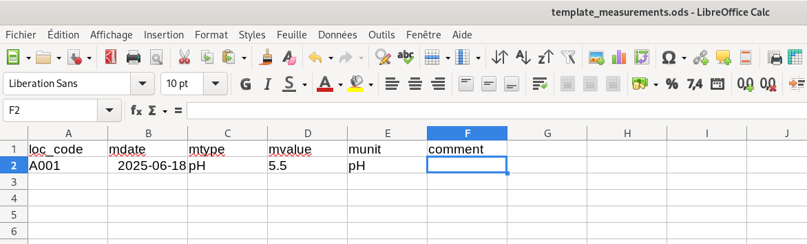

.. _add:

Ajouter des enregistrements
===========================

Saisie des données
------------------

Il est possible de saisir de nouveaux enregistrements dans la base de données. Dans l'interface ``MENU PRINCIPAL`` choisissez l'option
``1 - Ajouter de nouvelles données``, appuyez sur la touche ``1`` et validez avec la touche **Entrée**.

Le programme vous demandera alors quel est le type de données que vous souhaitez ajouter. Cela determinera dans quel **TABLE** de la base 
de données les enregistrements vont être sauvegarder. Pour sélectionner l'option désirée saisissez le chiffre correspondant et valider avec la touche 
**Entrée**.

Le programme va vous afficher un message de création du fichier LibreOffice dans lequel vous allez devoir renseigner vos données. Directement après reception 
de ce message ce fichier LibreOffice Calc s'ouvre::

    You're connected to dtabase:  ('SAFEM_DATA',)

    ===========================================================================
    MENU PRINCIPAL
    ===========================================================================
    Que souhaitez-vous faire ?
    1 - Ajouter de nouvelles données
    2 - Ajouter à partir d'un fichier déjà remplit
    3 - Visualiser/Modifier d'anciennes données
    4 - Quitter
    ===========================================================================
    ? 

    -> 1

        ===========================================================================
        MENU CHOIX DES DONNEES
        ===========================================================================
        Quelles données voulez-vous ajouter :
        1 - Localisation de puits/sources/rivières ?
        2 - Mesures physico-chimiques/piézométriques ?
        3 - Quitter le menu choix des données et retourner au menu principal
        ===========================================================================
    
    -> 2

    Fichier ODS 'template_measurements.ods' créé avec succès.
    Une fois le fichier LibreOffice enregistré, Appuyez sur Entrée

Ces fichiers LibreOffice ``template_measurements.ods`` et ``template_localisation.ods``, respectivement si vous souhaitez ajouter des données 
de mesures physico-chimique/piezométrique ou de localisation de puits, possède des entêtes de colonnes pré-remplies. Il vous suffit donc simplement 
de saisir les informations dans la colonne correspondante. Si vous ne possédez pas certaines informations non essentielle, aucun problème. Chaque 
ligne remplie correspond à un enregistrement. Une fois toutes les données saisis enregistré le fichier avec **CTRL + S** puis fermez le. Vous 
pouvez maintenant revenir au programme et appuyez sur **Entrée** pour ajouter ces nouvelles données dans la database::

    Database mis à jour

La base de données SAFEM_DATA est mise à jour et contient désormais vous nouveaux enregistrements dans les TABLES localisation ou measurements suivant le type de données ajouté.
Vous retombez ensuite sur le menu ``CHOIX DES DONNEES`` que vous pouvez quitter avec l'option ``3 - Quitter le menu choix des données et retourner au menu principal``
si vous n'avez plus aucun enregistrement à sauvegarder.

.. warning::

    Attention lors de la saisie de vos données dans le fichier LibreOffice que celle-ci respecte bien le format attendu.
    Pour vérifier si le format correspond toutes les informations sont rappelées avec les :ref:`skeleton`.

.. _import:

Importation des données
-----------------------

Le programme offre aussi la possibilité d'ajouter de nouveaux enregistrements directement à partir d'un fichier de données 
**LibreOffice Calc** déjà rempli auparavant. Dans l'interface ``MENU PRINCIPAL`` choisissez l'option
``2 - Ajouter à partir d'un fichier déjà remplit``, appuyez sur la touche ``2`` et validez avec la touche **Entrée**.
Comme pour une saisie direct de données vous devrez ensuite spécifié le type de données que vous souhaitez ajouter. 
Le programme vous affichera une notice quand au format que doit respecter votre tableau de données pour être ajouté sans encombre::

    ===========================================================================
    ATTENTION NOTICE
    ===========================================================================
    Pour ajouter des données à partir d'un fichier LibreOffice celui-ci doit respecter certaines conditions :
    - La nom du fichier doit être de la forme : donnees_measurements_***.ods
    - Les colonnes doivent commencer à la premiere case de la première ligne et dans l'ordre : 

    loc_code | mdate | mtype | mvalue | munit | comment 

    - La feuille de calcul sur laquelle sont notés les données doit s'appeler Feuille1
    ===========================================================================
    Appuyez sur Entrée une fois avoir pris connaissance de la notice.

Cela permet de s'assurer que les données saisies auront le même format que celui attendu par les ``TABLE`` de la database. Cette
notice est quelque peu différent selon le type d'enregistrements que vous voulez ajouter.

Après avoir pris connaissance de la notice appuyez sur la touche **Entrée** et le programme vous indique que votre fichier
doit se trouver dans le dossier ``DATA`` reservé à cet effet pour que le reste de la procédure fonctionne. Après vous avoir assurer 
du bon emplacement de votre fichier appuyez une seconde fois sur **Entrée**.

Le programme va alors vous afficher une liste numérotée des différents fichiers présent dans le dossier ``DATA`` correspondant au type de données
que vous avez selectionné. Renseignez le numéro de le liste correspondant au fichier contenant les enregistrements que vous souhaitez ajouter et validé 
avec la touche **Entrée**. Le fichier selectionné va être scanné et le nombre d'enregistrements contenus vous sera affiché pour éviter d'éventuelles
confusion. Dans une dernière étape cet à vous de valider si vous souhaitez ou non ajouter ces nouvelles données à la database. Répondre par ``O``, 
``o``, ``Y`` ou ``y`` mettra à jour la base de données tandis que les réponses ``N`` ou ``n`` annuleront l'opération en cours. Si les données ont bien été 
ajoutées dans le ``TABLE`` de ``SAFEM_DATA`` correspondant le programme vous le spécifiera avant de vous afficher à nouveau le ``MENU CHOIX DES DONNEES``::

    A présent vous pouvez déposer le fichier LibreOffice (.ods) dans le dossier DATA, Appuyer sur Entrée une fois le fichier déposé

    Fichiers disponibles:
    0 - donnees_measurements_2025-06-13.ods
    1 - donnees_measurements_2025-06-11.ods
    2 - donnees_measurements_2025-06-12.ods

    Choisissez votre fichier en entrant son numéro d'ordre: 

    -> 1

    Lecture du fichier donnees_measurements_2025-06-11.ods
    3 enregistrements trouvés dans le fichier.
    Voulez-vous insérer 3 enregistrements dans la base de données? (O/N): 

    -> O 

    Enregistrement terminé

    ===========================================================================
    MENU CHOIX DES DONNEES
    ===========================================================================
    Quelles données voulez-vous ajouter :
    1 - Localisation de puits/sources/rivières ?
    2 - Mesures physico-chimiques/piézométriques ?
    3 - Quitter le menu choix des données et retourner au menu principal
    ===========================================================================
                
Il est maintenant possible si vous le souhaitez de :ref:`modify` même plus anciens contenus dans la database ``SAFEM_DATA``.

